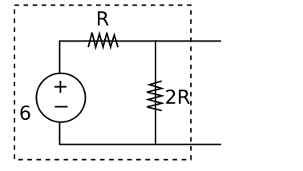
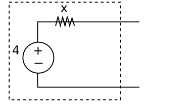
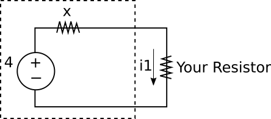
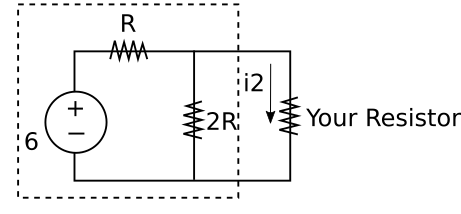

# 基礎電子學實驗 2020/10/13  實驗步驟

## 實驗目的

驗證及使用 Thevenin Theorem 

## 相關知識

基本電路分析及 Thevenin Theorem

## 實驗步驟

### 測開路電壓及 Thevenin 等效電阻值

如下圖之電路，可將最右方之電阻視為負載，其餘電路視為一供應其能量之電子系統：

對該負載而言，我們可使用 Thevenin Theorem 將左方之電子系統化簡為一電壓源串聯一等效電阻，也就是說下圖電路為上圖的等效電路：

現在，我們知道要求 Thevenin 等效電路我們需知道
1. 開路電壓，與
2. Thevenin 等效電阻值

若把原電路圖的負載移除 (也就是移除最右邊的電阻)，如下圖，則我們可知所欲求的開路電壓即為 v1：

使用麵包板建構上圖電路，並量測 v1 =_

接著，我們要來尋求 Thevenin 等效電阻值。這裡美妙之處在於我們可以結合並利用 voltage divider 的原理：由於 Thevenin 等效電路相當於一個電壓源串聯一個 Thevenin equivalent resistor，且該電壓源的值為開路電壓值，故若我們在原電子系統接上一個可變電阻，則這個可變電阻等效於與 Thevenin equivalent resistor 串聯，且跨過此可變電阻的 branch voltage 會符合 voltage divider 的原理。因此我們實務上可藉由調整該可變電阻值並測量其 branch voltage 直到該電壓值等於前述開路電壓的一半，即代表該電阻值與 Thevenin equivalent resistor 的電阻值相同。故我們可以此方式求得 Thevenin 等效電阻值。

現在，將剛剛麵包板上的電路再連接一可變電阻，如下圖（可變電阻為最右邊那個）：

動手調整並量測跨過該可變電阻的電壓，直到其為前述 v1 量測值的一半。此電壓值會等同於 v1' ，因為這兩個電阻是並聯。

接著量測符合上述條件的可變電阻值 x = _ 歐姆 （**！！注意：量測電阻值必須要把該電阻自電路取下！！**）

最後，我們建構以下兩電路來驗證 Thevenin Theorem ：

以上第一個電路即為實驗一開始的原電路，第二個電路為依據 Thevenin Theorem 建構的等效電路。

現在，使用一個電阻值至少為 1 k 歐姆的電阻作為負載，分別接於上述兩電路，並量測 i1= _ 及 i2 = _ ：

若 Thevenin Theorem 正確且上述步驟正確，則應可測得 i1 等於 i2 。

## 實驗結報

填寫上述實驗過程中各項劃底線項目的量測值。每組繳交一份結報即可。

