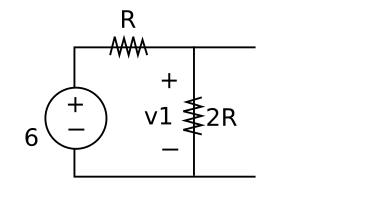

# 基礎電子學實驗 2020/10/13  預習報告

## 實驗目的

驗證及使用 Thevenin Theorem 

## 相關知識

1. 基本電路分析 (基礎電子學課程 up to 10/6)
2. Thevenin Theorem (10/13 基礎電子學課程)

## 預習項目

### 等效電路的計算 (symbolic computation)

如下圖之電路，求 branch voltage v1 =_

承上，若接著並聯一電阻值為 x 歐姆之電阻，如下圖，求 x 應為多少才能使得 branch voltage v1' 降為原先 v1 的一半?

承上，將電阻值 x 代入下圖電路，求 branch current i1=_

最後，在下圖電路中，求 branch current i2=_

i2 是否等於 i1? Your answer here.

