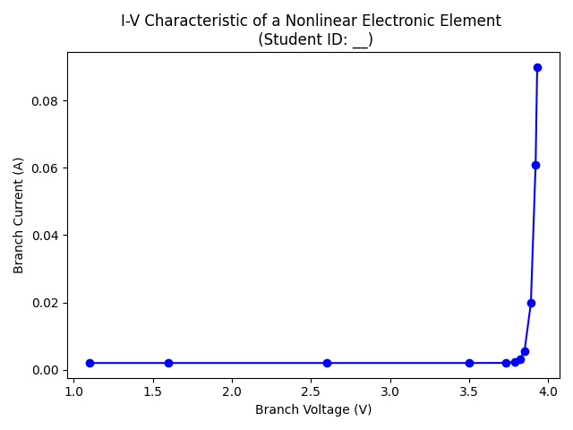

# 基礎電子學實驗 2020/10/20  預習報告

## 實驗目的

1. 瞭解操作非線性電子元件的實務技巧
2. 基本的實驗資料視覺化

## 相關知識

1. Python and [Matplotlib](https://matplotlib.org/)
2. 非線性電路的分析與設計 (10/20 基礎電子學課程)

## 預習項目

### 安裝 Python 及 Matplotlib 函式庫

Matplotlib 是基於 Python 的極佳資料視覺化工具。Take a look at what it can achieve: https://matplotlib.org/gallery/index.html

這次的實驗我們將用 Matplotlib 來繪製一個非線性元件的 i-v characteristic，過程中會不小心學到一些 Python (which is good).

關於 Python 及 Matplotlib 的安裝，網路上可以找到很多教學，建議先參考官方的教學：

1. https://www.python.org/downloads/
2. https://matplotlib.org/users/installing.html

Matplotlib 的官方使用手冊 can be found [here](https://matplotlib.org/users/index.html). Based on my own experience, an effective way to learn Matplotlib (and Python) is by playing with some examples: Try to change some parameters in an example you found, and see what will happen. Note your observation, and then tweak the code from another perspective, and repeat.

參考如下的範例程式 plot.py ，其中 # 符號後的內容為註解：

```python
# import the necessary modules
import numpy as np
import matplotlib.pyplot as plt

# read the input file
samples = np.loadtxt('./samples.txt')

# create lists for x and y value
x = samples[:, 0]
y = samples[:, 1]
# the above two lines can be merged into one single statement:
# x, y = samples[:, 0], samples[:, 1]

# initialize a figure
fig1, ax1 = plt.subplots()

# plot the data
ax1.plot(x, y, 'bo-')

# set the labels
ax1.set_xlabel('Branch Voltage (V)')
ax1.set_ylabel('Branch Current (A)')
ax1.set_title('I-V Characteristic of a Nonlinear Electronic Element \n (Student ID: __)')

# make the figure tight
plt.tight_layout()

# show the resulting figure
plt.show()
```

執行上述程式會產生如下圖表：



上述程式使用的資料來自 samples.txt 這個檔案如下，其中每行的第一個數值為電壓值，第二個數值為電流值，共有 11 筆資料：

```
1.1 0.002
1.6 0.002
2.6 0.002
3.5 0.002000002979957987
3.73 0.002029502924916446
3.79 0.0023252159551219835
3.82 0.003079754998464535
3.85 0.0055849128451316305
3.89 0.019756189564520563
3.92 0.060952625458802465
3.93 0.08994698265072967
```

從這次實驗的資料夾中下載 plot.py 及 samples.txt ，執行 plot.py 自行玩玩看。

欲進一步瞭解 plot() 的功能及用法，可參考這個[說明文件](https://matplotlib.org/api/_as_gen/matplotlib.pyplot.plot.html#matplotlib.pyplot.plot)及這個[官方教學](https://matplotlib.org/tutorials/introductory/pyplot.html)。 Matplotlib is awesome.


### 預報繳交項目

請在 samples.txt 中加入一筆新的資料 (i.e., add a new row in the file)，i 跟 v 的數值可自行決定。接著執行 plot.py 來畫折線圖，確認你的圖中共包含 12 筆資料，並記得修改 plot.py 的內容，使得在圖中的 title 有註明你的學號。將圖片存檔後上傳至 Moodle 即可。