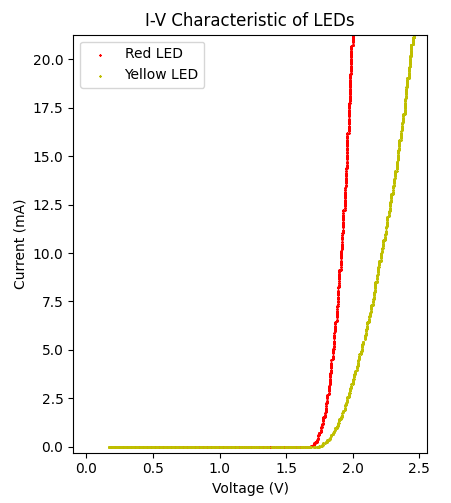

# 基礎電子學實驗 2020 12/8-12/15  實驗

## 實驗目的

體驗一個小型軟硬體整合的系統設計與實作，包含四個面向：

1. 探討可量測特定電子元件特性的系統設計及實作 - 以發光二極體 (i.e., LED) 元件為例
2. 熟悉示波器及訊號產生器的整合操作
3. 熟悉 Arduino 作為類比訊號採集器的用法
4. 進一步瞭解使用 Matplotlib 將實驗結果視覺化的選項

## 相關知識

先前實驗課所累積的各項知識及操作經驗

## 實驗預報

此次預習分為兩部分: ADC 與資料視覺化

#### 1. ADC (Analog-to-Digital Converter) 類比-數位轉換器

Arduino 等嵌入式系統在讀取特定 pin 腳輸入的電壓 (analog signal) 時，需有方法來將某範圍內的輸入電壓值對應到一個數值 (digital signal) 輸出，也就是說將某區間內的所有數值對應到一個離散數值。實現這個對應的電路統稱為 ADC (Analog-to-Digital Converter)。在嵌入式系統上我們再從這個離散的 ADC 輸出值換算推估原先輸入的電壓值是多少。

ADC 有兩個重要參數：參考電壓 (reference voltage) 及解析度 (resolution) 。解析度用位元數代表 (number of bits)，配合參考電壓則可計算多大範圍的電壓訊號會對應到一個數值輸出。舉例來說，若參考電壓為 5V ，解析度為 3 bits ，則代表這個 ADC 可以有 2^3=8 種數值輸出，即 0~7 這八種數值，而每個數值涵蓋了 5/(8-1)=0.714V 的電壓範圍 (可以這樣想像：一個五單位長度的尺有八個刻度，拿這把尺去量東西，則測量值只有八種，依序為 0, 0.714, 2\*0.714, 3\*0.714, 4\*0.714, 5\*0.714, 6\*0.714, 7\*0.714=5 這八種)。

例如用上述規格的 ADC 若輸入電壓為 3.3V 則 ADC 會輸出 5 。當我們要從 ADC 的輸出換算回電壓時，只能得出 5\*(5/(8-1))=3.57V。輸入電壓為 2.9V 則 ADC 也會輸出 5，也就是說換算電壓亦會得出 3.57V。這個例子告訴我們，若輸入電壓的變化量小於 5/(8-1)=0.714V 則透過 ADC 的轉換後將分辨不出這個變化。換句話說，這個 ADC 僅能分辨大於 0.714V 的電壓變化。若要提高能分辨 (或說能解析) 的電壓變化，則有兩種修改規格的策略：

1. 增加解析度，也就是說增加用來解析的位元數; 例如若改用 4-bit 的 ADC 則其將能分辨 5/(2^4-1)=0.333V 的電壓變化;
2. 降低參考電壓; 例如改用 3.3V 的參考電壓，則其將能分辨 3.3/(2^3-1)=0.471V 的電壓變化;

**預報題目 part 1：**

1. Arduino Uno 內建 10-bit ADC ，預設參考電壓 5V (參考資料 [1](https://www.arduino.cc/reference/en/language/functions/analog-io/analogread/) [2](https://www.arduino.cc/en/Reference/AnalogReference&)) ，請計算其能分辨多大範圍的電壓變化?

2. 給一個理由，說明為何若想提高分辨電壓變化的能力，我們會傾向增加 ADC 的 bit 數而不是降低參考電壓。

   

#### 2. 資料視覺化

此次實驗我們將嘗試以軟硬體整合的方式，來自動量測並繪製較為精確之 LED i-v 關係圖。實驗結果舉例如下：

**預報題目 part 2:** 

請使用此資料夾內的 Matplotlib script (iv.py) 及一組實驗結果 (yellow.txt and red.txt) 嘗試重新繪製如上的關係圖。**請修改第九行的標題，加入您的組別及學號，將製圖結果上傳即可。**
