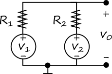
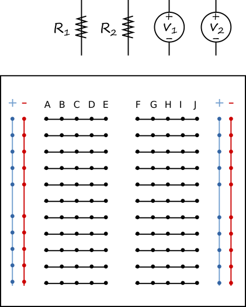

# 基礎電子學實驗 2020/10/6  預習報告

## 實驗目的

設計簡易加法電路，以及驗證 superposition 原理

## 相關知識

1. 加法電路 (9/29 基礎電子學課程)
2. Superposition (10/6 基礎電子學課程)

## 預習項目

### 加法電路的設計

如下圖之加法電路，若欲使得 V0 = f1(R1,R2) * V1 + f2(R1,R2) * V2 且 f1(R1,R2) / f2(R1,R2) = 3/2 ，也就是說 V0 為 V1 與 V2 的權重加法，其中 function f1 為 V1 的權重，function f2 為 V2 的權重，且 f1 及 f2 各可表為電阻 R1 及 R2 的函數。設 R2 = 4.7 K 歐姆，則應使用多少歐姆的電阻 for R1?

Your answer (請詳述論證過程): 

### 加法電路的線路連接

承上，將下列四個元件手繪複製並連接於下圖的麵包板，使其符合上圖的電路:

 
